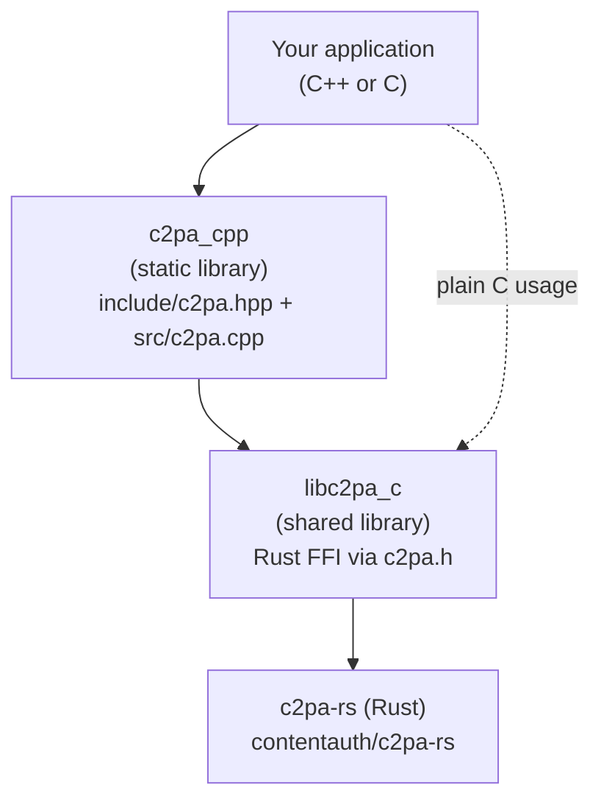
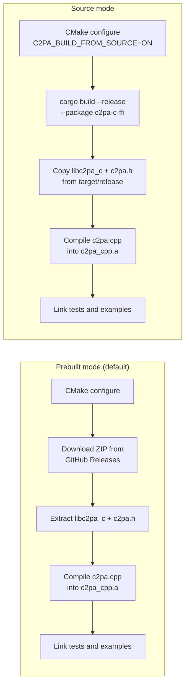

# c2pa-c amalgam build (vNext)

## Overview

An amalgam build (or amalgamation) is a technique for distributing a library as a
self-contained, buildable unit. In its simplest form, amalgamation concatenates an
entire library into a single source file that any project can drop in and compile.
The goal is the same here, though the form is different: instead of concatenating
everything into one file, this amalgam collects the C++ wrapper source, the build
system, the prebuilt Rust shared library, tests, examples, and CI configuration into
a single directory tree that can be built with one command (`make test`). Nothing
outside this tree is required at build time (the Rust library is fetched automatically).

This is the amalgam build of the C++ bindings for the C2PA SDK. It wraps a Rust-compiled shared library (`libc2pa_c`)
in idiomatic C++17, providing a complete project that can read, create, and sign
C2PA manifests from C++ (and plain C) applications.

## Architecture

The build produces a three-layer stack. Applications link against the C++ library
(`c2pa_cpp`, built as a static archive by default), which in turn depends on the Rust
shared library (`libc2pa_c`) at runtime. An application may also link `libc2pa_c` directly if 
using the plain C API without the C++ wrapper.



---

## Tools

The following tools are required to build the project.

### CMake 3.27+

CMake is the build system generator.

- **macOS:** `brew install cmake`
- **Ubuntu/Debian:** `sudo apt install cmake` (check that your distro provides 3.27+; otherwise install from [cmake.org](https://cmake.org/download/))
- **Windows:** Download the installer from [cmake.org](https://cmake.org/download/) or use `winget install Kitware.CMake`

### Ninja

Ninja is the build backend. The Makefile passes `-G "Ninja"` to CMake.

- **macOS:** `brew install ninja`
- **Ubuntu/Debian:** `sudo apt install ninja-build`
- **Windows:** `winget install Ninja-build.Ninja` or download from [GitHub](https://github.com/ninja-build/ninja/releases)

### C++17 compiler

Any compiler that supports the C++17 standard will work. LLVM Clang is recommended.

- **macOS:** `brew install llvm` for the latest LLVM Clang toolchain. Apple Clang from Xcode Command Line Tools (`xcode-select --install`) also works.
- **Ubuntu/Debian:** `sudo apt install clang` for LLVM Clang (preferred), or `sudo apt install g++` for GCC (9+ recommended; GCC 8 may need explicit `-lstdc++fs`).
- **Windows:** Install Visual Studio 2019 or later with the "Desktop development with C++" workload. The CI uses MSVC via `ilammy/msvc-dev-cmd`. Alternatively, install LLVM Clang from [llvm.org](https://releases.llvm.org/download.html).

### Rust toolchain (source builds only)

Only needed if you set `C2PA_BUILD_FROM_SOURCE=ON`. Install via [rustup.rs](https://rustup.rs/):

```bash
curl --proto '=https' --tlsv1.2 -sSf https://sh.rustup.rs | sh
```

### Doxygen (documentation only)

Only needed for `make docs`.

- **macOS:** `brew install doxygen`
- **Ubuntu/Debian:** `sudo apt install doxygen`

## How the build works

### Build modes

There are two ways the Rust library is obtained:



**Prebuilt mode** (the default) downloads a platform-specific ZIP archive from the
[c2pa-rs GitHub Releases](https://github.com/contentauth/c2pa-rs/releases) page.
For example, the current version downloads from the
[c2pa-v0.75.21 release assets](https://github.com/contentauth/c2pa-rs/releases/tag/c2pa-v0.75.21).
The ZIP contains `lib/libc2pa_c.{dylib,so,dll}` and `include/c2pa.h`.

**Source mode** requires a local checkout of `c2pa-rs` and a working Rust toolchain.
Enable it with:

```bash
make debug C2PA_BUILD_FROM_SOURCE=ON C2PA_RS_PATH=/path/to/c2pa-rs
```

The Cargo command used is:

```bash
cargo build --release --package c2pa-c-ffi --no-default-features --features "rust_native_crypto, file_io"
```

### Quick start

```bash
# Debug build and run all tests
make test

# Release build
make release

# Build and run examples
make examples

# Run with sanitizers (ASAN + UBSAN)
make test-san

# Run a single test
make run-single-test TEST=BuilderTest.SignFile

# Generate Doxygen API docs
make docs
```

---

## Build artifacts

After `make release`, the build directory contains:

| Artifact | Location | Description |
|----------|----------|-------------|
| `c2pa_cpp.a` | `build/release/src/` | Static C++ wrapper library |
| `libc2pa_c.dylib` (macOS) | `build/release/tests/` and `build/release/examples/` | Rust shared library (copied to each executable directory) |
| `libc2pa_c.so` (Linux) | Same as above | Rust shared library |
| `c2pa_c.dll` (Windows) | Same as above | Rust shared library |
| `c2pa_c_tests` | `build/release/tests/` | C++ GoogleTest executable |
| `ctest` | `build/release/tests/` | Pure C test executable |
| `training` | `build/release/examples/` | Training-mining signing example |
| `demo` | `build/release/examples/` | Deprecated-API demo |

The shared library `libc2pa_c` is copied into each executable's directory at build time.
RPATH is set to `@executable_path` (macOS) or `$ORIGIN` (Linux) so executables find
the shared library at runtime without needing `LD_LIBRARY_PATH`.

---

## Integrating into your project

### Option 1: CMake subdirectory

Add this project as a subdirectory in your CMakeLists.txt:

```cmake
add_subdirectory(path/to/c2pa-c)
target_link_libraries(your_target PRIVATE c2pa_cpp)
```

The `c2pa_cpp` target exports the include directories for both `c2pa.hpp` and `c2pa.h`.

### Option 2: CMake install

Build and install, then use `find_package`:

```bash
cmake -S . -B build/release -DCMAKE_BUILD_TYPE=Release -DCMAKE_INSTALL_PREFIX=/usr/local
cmake --build build/release
cmake --install build/release
```

Then in your project:

```cmake
find_package(c2pa_cpp REQUIRED)
target_link_libraries(your_target PRIVATE c2pa_cpp::c2pa_cpp)
```

### Option 3: Manual integration

1. Build this project with `make release`.
2. Copy these files into your project:
   - `include/c2pa.hpp` -- the C++ header
   - `build/release/_deps/c2pa_prebuilt-src/include/c2pa.h` -- the C FFI header
   - `build/release/src/libc2pa_cpp.a` (or `c2pa_cpp.lib`) -- the static C++ library
   - `build/release/tests/libc2pa_c.dylib` (or `.so` or `.dll`) -- the Rust shared library
3. Add the include paths and link against both libraries.
4. Ensure `libc2pa_c` is in the same directory as your executable or on the library search path.

### Runtime requirement

The shared library `libc2pa_c.{dylib,so,dll}` must be discoverable at runtime.
The build system sets RPATH to `@executable_path` (macOS) or `$ORIGIN` (Linux),
so placing the shared library next to your executable should be sufficient.
On Windows, place `c2pa_c.dll` next to your `.exe`.

---

## Build limitations

- **Ninja is expected.** The Makefile passes `-G "Ninja"` to CMake. If Ninja is not installed,
  either install it or call CMake directly with a different generator
  (e.g., `-G "Unix Makefiles"`).

- **CMake 3.27+ required.** Older CMake versions will not work. The `FetchContent` usage
  and certain policies depend on this version.

- **Source builds are only tested on Linux.** Building from source with
  `C2PA_BUILD_FROM_SOURCE=ON` has only been validated on Linux. macOS and Windows source
  builds may require additional troubleshooting with the Rust toolchain.

- **MinGW ABI warning.** On Windows, using MinGW with the MSVC-compiled prebuilt DLL
  may cause ABI compatibility issues. Use the MSVC compiler on Windows.

- **Prebuilt platform coverage.** Prebuilt binaries are available for:
  - macOS: x86_64, aarch64 (Apple Silicon)
  - Linux: x86_64, aarch64 (glibc-based)
  - Windows: x86_64 (MSVC)

  Other platforms (musl, FreeBSD, 32-bit) require building from source.

- **glibc version dependency.** The prebuilt Linux binaries target a specific glibc version.
  If your system has an older glibc, use `C2PA_BUILD_FROM_SOURCE=ON`.

---

## Q&A

### Why is this called an "amalgam" build?

Amalgamation is a distribution technique where a library is packaged as a self-contained,
buildable unit. In its classic form, amalgamation concatenates an entire library into a
single source file that any project can drop in and compile. This project follows the
same principle in a different form: rather than a single file, it collects
the C++ wrapper source (include/c2pa.hpp, src/c2pa.cpp), the build system
(CMakeLists.txt, Makefile), the prebuilt Rust shared library (fetched automatically),
tests, examples, and CI configuration into one directory tree. You can clone it,
run `make test`, and have a working build without installing anything beyond
CMake, Ninja, and a C++17 compiler.

### Why is there both a static library and a shared library?

The static library (`c2pa_cpp.a`) contains only the C++ wrapper code. The actual C2PA
implementation lives in the Rust shared library (`libc2pa_c`). This split exists because:

1. The Rust library is built as a `cdylib` (C-compatible dynamic library). This is the
   standard way Rust exposes FFI to C/C++.
2. The C++ wrapper adds RAII, exceptions, `std::string`, `std::filesystem::path`, and
   stream abstractions on top of the raw C API.
3. Statically linking the Rust code would require all of Rust's standard library and
   dependencies to be linked in, which is not supported by the current build.

If you are using the plain C API (via `c2pa.h`) without the C++ wrapper, you only
need to link against `libc2pa_c` directly.

### Why does the build download a prebuilt binary?

Building the Rust library from source requires a full Rust toolchain (cargo, rustc)
and can take several minutes. The prebuilt download makes the build fast and does
not require Rust to be installed. The prebuilt binaries are published as part of the
`c2pa-rs` release process on GitHub.

### What happens if the shared library is not found at runtime?

The application will fail to load with a dynamic linker error. On macOS you will see
`dyld: Library not loaded: libc2pa_c.dylib`. On Linux: `error while loading shared
libraries: libc2pa_c.so: cannot open shared object file`. On Windows: a missing DLL dialog.

Ensure the shared library is in the same directory as your executable, or set
`DYLD_LIBRARY_PATH` (macOS), `LD_LIBRARY_PATH` (Linux), or `PATH` (Windows).
