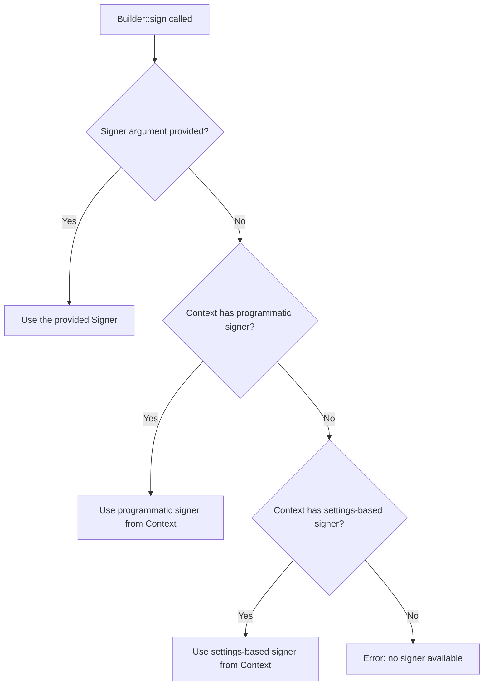
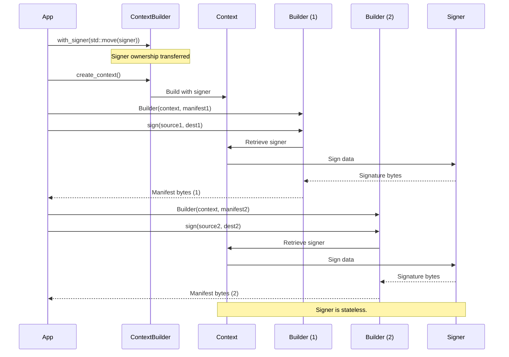
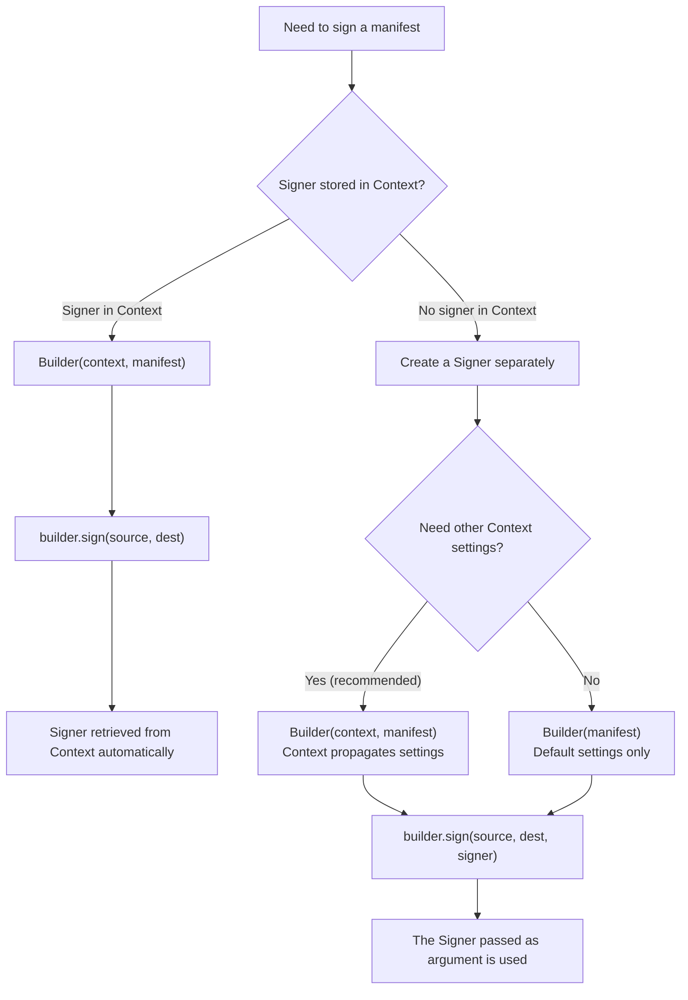

# Using Context to configure the SDK

Use the `Context` class to configure how `Reader`, `Builder`, and other aspects of the SDK operate.

## What is Context?

Context encapsulates SDK configuration:

- **Settings**: Verification options, [`Builder` behavior](#configuring-builder), [`Reader` trust configuration](#configuring-reader), thumbnail configuration, and more. See [Using settings](settings.md) for complete details.
- [**Signer configuration**](#configuring-a-signer): Optional signer credentials and settings that can be stored in the Context for reuse.
- **State isolation**: Each `Context` is independent, allowing different configurations to coexist in the same application.

### Why use Context?

`Context` is better than deprecated global/thread-local `Settings` because it:

- **Makes dependencies explicit**: Configuration is passed directly to `Reader` and `Builder`, not hidden in global state.
- **Enables multiple configurations**: Run different configurations simultaneously. For example, one for development with test certificates, another for production with strict validation.
- **Eliminates thread-local state**: Each `Reader` and `Builder` gets its configuration from the `Context` you pass, avoiding subtle bugs from shared state.
- **Simplifies testing**: Create isolated configurations for tests without worrying about cleanup or interference between them.
- **Improves code clarity**: Reading `Builder(context, manifest)` immediately shows that configuration is being used.

> [!NOTE]
> The deprecated `c2pa::load_settings(data, format)` still works for backward compatibility but you are encouraged to migrate your code to use `Context`. See [Migrating from thread-local Settings](#migrating-from-thread-local-settings).

## Creating a Context

There are several ways to create a `Context`, depending on your needs:

- [Using SDK default settings](#using-sdk-default-settings)
- [From an inline JSON string](#from-an-inline-json-string)
- [From a Settings object](#from-a-settings-object)
- [Using ContextBuilder](#using-contextbuilder)

### Using SDK default settings

The simplest approach is using [SDK default settings](settings.md#default-configuration).

**When to use:** For quick prototyping, or when you're happy with default behavior (verification enabled, thumbnails enabled at 1024px, and so on).

```cpp
#include "c2pa.hpp"

c2pa::Context context;  // Uses SDK defaults
```

### From an inline JSON string

You can pass settings to the constructor directly as a JSON string.

**When to use:** For simple configuration that doesn't need to be shared across the codebase, or when hard-coding settings for a specific purpose (for example, a utility script).

```cpp
c2pa::Context context(R"({
  "version": 1,
  "verify": {"verify_after_sign": true},
  "builder": {
    "thumbnail": {"enabled": false},
    "claim_generator_info": {"name": "An app", "version": "0.1.0"}
  }
})");
```

### From a Settings object

You can build a `Settings` object programmatically, then create a `Context` from that.

**When to use:** For configuration that needs runtime logic (such as conditional settings based on environment), or when you want to build settings incrementally.

```cpp
c2pa::Settings settings;
settings.set("builder.thumbnail.enabled", "false");
settings.set("verify.verify_after_sign", "true");
settings.update(R"({
  "builder": {
    "claim_generator_info": {"name": "An app", "version": "0.1.0"}
  }
})");

c2pa::Context context(settings);
```

### Using ContextBuilder

You can combine multiple configuration sources by using `Context::ContextBuilder`.

Use **ContextBuilder** when you want to:

- Load from a file with `with_json_settings_file()`.
- Combine a base `Settings` with environment-specific overrides from a JSON file.
- Apply multiple JSON snippets in a specific order.

**Don't use ContextBuilder** if you have a single configuration source. In this case, [direct construction from a Settings object](#from-a-settings-object) using `c2pa::Context context(settings)` is simpler and more readable.

For example:

```cpp
c2pa::Settings base_settings;
base_settings.set("builder.thumbnail.enabled", "true");
base_settings.set("builder.thumbnail.long_edge", "1024");

auto context = c2pa::Context::ContextBuilder()
    .with_settings(base_settings)
    .with_json(R"({"verify": {"verify_after_sign": true}})")
    .with_json_settings_file("config/overrides.json")
    .create_context();
```

> [!IMPORTANT]
> Later configuration overrides earlier configuration. In the example above, if `overrides.json` sets `builder.thumbnail.enabled` to `false`, it will override the `true` value from `base_settings`.

**ContextBuilder methods**

| Method | Description |
|--------|-------------|
| `with_settings(settings)` | Apply a `Settings` object. Must be valid (not moved-from). |
| `with_json(json_string)` | Apply settings from a JSON string. Later calls override earlier ones. |
| `with_json_settings_file(path)` | Load and apply settings from a JSON file. Throws `C2paException` if file doesn't exist or is invalid. |
| `create_context()` | Build and return the `Context`. Consumes the builder (it becomes invalid and cannot be reused). |

## Common configuration patterns

### Development environment with test certificates

During development, you often need to trust self-signed or custom CA certificates:

```cpp
// Load your test root CA
std::string test_ca = read_file("test-ca.pem");

c2pa::Context dev_context(R"({
  "version": 1,
  "trust": {
    "user_anchors": ")" + test_ca + R"("
  },
  "verify": {
    "verify_after_reading": true,
    "verify_after_sign": true,
    "remote_manifest_fetch": false,
    "ocsp_fetch": false
  },
  "builder": {
    "claim_generator_info": {"name": "Dev Build", "version": "dev"},
    "thumbnail": {"enabled": false}
  }
})");
```

### Configuration from environment variables

Adapt configuration based on the runtime environment:

```cpp
std::string env = std::getenv("ENVIRONMENT") ? std::getenv("ENVIRONMENT") : "dev";

c2pa::Settings settings;
if (env == "production") {
    settings.update(read_file("config/production.json"), "json");
    settings.set("verify.strict_v1_validation", "true");
} else {
    settings.update(read_file("config/development.json"), "json");
    settings.set("verify.remote_manifest_fetch", "false");
}

c2pa::Context context(settings);
```

### Layered configuration

Load base configuration from a file and apply runtime overrides:

```cpp
auto context = c2pa::Context::ContextBuilder()
    .with_json_settings_file("config/base.json")
    .with_json_settings_file("config/" + environment + ".json")
    .with_json(R"({
      "builder": {
        "claim_generator_info": {
          "version": ")" + app_version + R"("
        }
      }
    })")
    .create_context();
```

For the full list of settings and defaults, see [Configuring settings](settings.md).

## Configuring Reader

Use `Context` to control how `Reader` validates manifests and handles remote resources, including:

- **Verification behavior**: Whether to verify after reading, check trust, and so on.
- [**Trust configuration**](#trust-configuration): Which certificates to trust when validating signatures.
- [**Network access**](#offline-operation): Whether to fetch remote manifests or OCSP responses.
- **Performance**: Memory thresholds and other core settings.

> [!IMPORTANT]
> `Context` is used only at construction. `Reader` copies the configuration it needs internally, so the `Context` object does not need to outlive the `Reader`. This means you can safely use temporary point-in-time contexts; for example, as shown below.

```cpp
c2pa::Reader reader(
    c2pa::Context(R"({"verify": {"remote_manifest_fetch": false}})"),
    "image.jpg"
);
```

### Reading from a file

```cpp
// Context that disables remote manifest fetch (for offline environments)
c2pa::Context context(R"({
  "version": 1,
  "verify": {
    "remote_manifest_fetch": false,
    "ocsp_fetch": false
  }
})");

c2pa::Reader reader(context, "image.jpg");
std::cout << reader.json() << std::endl;
```

### Reading from a stream

```cpp
std::ifstream stream("image.jpg", std::ios::binary);
c2pa::Reader reader(context, "image/jpeg", stream);

std::cout << reader.json() << std::endl;
```

### Trust configuration

Example of trust configuration in a settings file:

```json
{
  "version": 1,
  "trust": {
    "user_anchors": "-----BEGIN CERTIFICATE-----\nMIICEzCCA...\n-----END CERTIFICATE-----",
    "trust_config": "1.3.6.1.4.1.311.76.59.1.9\n1.3.6.1.4.1.62558.2.1"
  }
}
```

**PEM format requirements:**

- Use literal `\n` characters (as two-character strings) in JSON for line breaks.
- Include the full certificate chain if needed.
- Concatenate multiple certificates into a single string.

Then load the file in your application as follows:

```cpp
auto context = c2pa::Context::ContextBuilder()
    .with_json_settings_file("dev_trust_config.json")
    .create_context();

c2pa::Reader reader(context, "signed_asset.jpg");
```

### Full validation

To configure full validation, with all verification features enabled:

```cpp
c2pa::Context full_validation_context(R"({
  "verify": {
    "verify_after_reading": true,
    "verify_trust": true,
    "verify_timestamp_trust": true,
    "remote_manifest_fetch": true
  }
})");

c2pa::Reader online_reader(full_validation_context, "asset.jpg");
```

For more information, see [Settings - Verify](settings.md#verify).

### Offline operation

To configure `Reader` to work with no network access:

```cpp
c2pa::Context offline_context(R"({
  "verify": {
    "remote_manifest_fetch": false,
    "ocsp_fetch": false
  }
})");

c2pa::Reader offline_reader(offline_context, "local_asset.jpg");
```

For more information, see [Settings - Offline or air-gapped environments](settings.md#offline-or-air-gapped-environments).


## Configuring Builder

`Builder` uses `Context` to control how to create and sign C2PA manifests. The `Context` affects:

- **Claim generator information**: Application name, version, and metadata embedded in the manifest.
- **Thumbnail generation**: Whether to create thumbnails, size, quality, and format.
- **Action tracking**: Auto-generation of actions like `c2pa.created`, `c2pa.opened`, `c2pa.placed`.
- **Intent**: The purpose of the claim (create, edit, or update).
- **Verification after signing**: Whether to validate the manifest immediately after signing.
- **Signer configuration** (optional): Credentials can be stored in settings for reuse.


> [!IMPORTANT]
> The `Context` is used only when constructing the `Builder`. The `Builder` copies the configuration it needs internally, so the `Context` object does not need to outlive the `Builder`.

### Basic use

```cpp
c2pa::Context context(R"({
  "version": 1,
  "builder": {
    "claim_generator_info": {
      "name": "An app",
      "version": "0.1.0"
    },
    "intent": {"Create": "digitalCapture"}
  }
})");

c2pa::Builder builder(context, manifest_json);

// Pass signer explicitly at signing time
c2pa::Signer signer("es256", certs, private_key);
builder.sign(source_path, output_path, signer);
```

### Controlling thumbnail generation

```cpp
// Disable thumbnails for faster processing
c2pa::Context no_thumbnails(R"({
  "builder": {
    "claim_generator_info": {"name": "Batch Processor"},
    "thumbnail": {"enabled": false}
  }
})");

// Or customize thumbnail size and quality for mobile
c2pa::Context mobile_thumbnails(R"({
  "builder": {
    "claim_generator_info": {"name": "Mobile App"},
    "thumbnail": {
      "enabled": true,
      "long_edge": 512,
      "quality": "low",
      "prefer_smallest_format": true
    }
  }
})");
```

## Configuring a signer

The `signer` field in settings can specify:
- A **local signer** — certificate and key (paths or PEM strings):
  - `signer.local.alg` — e.g. `"ps256"`, `"es256"`, `"ed25519"`.
  - `signer.local.sign_cert` — certificate file path or PEM string.
  - `signer.local.private_key` — key file path or PEM string.
  - `signer.local.tsa_url` — optional TSA URL.
- A **remote signer** — A POST endpoint that receives data to sign and returns the signature:
  - `signer.remote.url` — signing service URL.
  - `signer.remote.alg`, `signer.remote.sign_cert`, `signer.remote.tsa_url`.

See [SignerSettings object reference](https://opensource.contentauthenticity.org/docs/manifest/json-ref/settings-schema/#signersettings) for the full property reference.

You can configure a signer:

- [From JSON Settings](#from-settings)
- [Explicitly in code](#explicit-signer)
- [In the Context](#signer-in-context)

### From Settings

Put signer configuration in your JSON or `Settings`:

```json
{
  "signer": {
    "local": {
      "alg": "ps256",
      "sign_cert": "path/to/cert.pem",
      "private_key": "path/to/key.pem",
      "tsa_url": "http://timestamp.example.com"
    }
  }
}
```

Then create a `Context` and use it with `Builder`; for example:

```cpp
c2pa::Context context(settings_json_or_path);
c2pa::Builder builder(context, manifest_json);
// When you call sign(), use a Signer created from your cert/key,
// or the SDK may use the signer from context if the C API supports it.
builder.sign(source_path, dest_path, signer);
```

In the C++ API you typically create a `c2pa::Signer` explicitly and pass it to `Builder::sign()`. Settings in the `Context` still control verification, thumbnails, and other builder behavior.

### Explicit signer

For full programmatic control, create a `Signer` and pass it to `Builder::sign()`:

```cpp
c2pa::Signer signer("es256", certs_pem, private_key_pem, "http://timestamp.digicert.com");
c2pa::Builder builder(context, manifest_json);
builder.sign(source_path, dest_path, signer);
```

The `Context` continues to control verification and builder options. The signer is used only for the cryptographic signature.

### Signer in context

A `Signer` can be passed explicitly to `Builder::sign()` at the time of signing. A Signer can also be stored inside a `Context` passed into a Builder. This is referred to as a contextual signer and is useful when configuring a Signer once and reusing it across multiple Builder objects.

A contextual signer is stateless and reusable. The underlying `sign()` operation uses an immutable reference, so the same Signer can be used for multiple signing operations without side effects:

```cpp
auto context = c2pa::Context::ContextBuilder()
    .with_signer(std::move(signer))
    .create_context();

// Same context and signer used for multiple independent signing operations.
auto builder1 = c2pa::Builder(context, manifest1);
auto data1 = builder1.sign(source1, dest1);

auto builder2 = c2pa::Builder(context, manifest2);
auto data2 = builder2.sign(source2, dest2);
```

There are three ways to store a signer in the context:

| Approach | Best for | Signer lifetime |
| --- | --- | --- |
| [Settings-based](#settings-based-signer) | Config-file-driven workflows (configured in Settings file). | Stored in the `Context` and available to every `Builder` that uses that context. |
| [Programmatic](#programmatic-signer) | Programmatic configuration. | Stored in the `Context` and available to every `Builder` that uses that context. |
| [Callback](#callback-signer) | Custom signing logic where keys don't leave secure locations. | Stored in the `Context`, the callback is invoked at signing time. |

#### Settings-based signer

When signer credentials are included in a settings JSON file, the `Context` uses them automatically to configure a contextual signer. The `Builder` uses that signer from the context when `sign()` is called without a `Signer` argument:

```cpp
// Load settings from a JSON file that contains signer credentials.
auto context = c2pa::Context::ContextBuilder()
    .with_json_settings_file("config/settings_with_signer.json")
    .create_context();

c2pa::Builder builder(context, manifest_json);

// Sign using the signer from the context (no explicit Signer object as parameter).
auto manifest_bytes = builder.sign(source_path, dest_path);
```

#### Configuring a Signer

Signers can also be created entirely in code. A `c2pa::Signer` object can be moved into a `Context` using `ContextBuilder::with_signer()`, making it available as a contextual signer.

```cpp
c2pa::Signer signer("es256", certs_pem, private_key_pem,
                     "http://timestamp.digicert.com");

auto context = c2pa::Context::ContextBuilder()
    .with_signer(std::move(signer))
    .create_context();

c2pa::Builder builder(context, manifest_json);

// Sign using the signer that was moved into the context
auto manifest_bytes = builder.sign(source_path, dest_path);
```

A `Context` can be constructed from both a `Settings` object and a `Signer` in a single call:

```cpp
c2pa::Settings settings;
settings.set("builder.thumbnail.enabled", "false");

c2pa::Signer signer("es256", certs_pem, private_key_pem);
c2pa::Context context(settings, std::move(signer));
```

> [!NOTE]
> `with_signer()` consumes the `Signer`. After the call, the source `Signer` is invalid and must not be reused.

#### Callback signer

A callback signer allows the caller to supply a custom signing function. Instead of providing a private key to the SDK, the caller provides a function that receives the data to sign and returns the raw signature bytes. The SDK invokes this function at signing time.

The callback signature type is:

```cpp
using SignerFunc = std::function<std::vector<unsigned char>(
    const std::vector<unsigned char>& data)>;
```

A callback-based `Signer` is created and moved into the context:

```cpp
// Callback that delegates signing to your HSM or KMS.
auto my_signing_callback = [](const std::vector<unsigned char>& data)
    -> std::vector<unsigned char> {
    // Call the custom signer here.
    return sign_with_hsm(data);
};

c2pa::Signer signer(
    my_signing_callback,
    C2paSigningAlg::Es256,
    certificate_chain_pem,
    "http://timestamp.digicert.com"
);

auto context = c2pa::Context::ContextBuilder()
    .with_signer(std::move(signer))
    .create_context();

c2pa::Builder builder(context, manifest_json);
auto manifest_bytes = builder.sign(source_path, dest_path);
```

#### Signer precedence

When a context contains both a settings-based signer (from JSON) and a signer set explicitly (from `with_signer()`), the signer set explicitly throught the API call takes precedence. This allows a settings file to serve as a default while code overrides it when needed.

```cpp
// Settings file contains an es256 signer.
auto settings = c2pa::Settings(settings_json, "json");

// Newly create signer overrides the one from settings.
c2pa::Signer signer("ed25519", certs_pem, private_key_pem);

c2pa::Context context(settings, std::move(signer));
c2pa::Builder builder(context, manifest_json);

// Uses the explicitly configured and create ed25519 signer, not the settings es256 signer.
auto manifest_bytes = builder.sign(source_path, dest_path);
```

The following diagram shows how the SDK resolves which signer to use at signing time:



#### Signing flow

The following diagram shows how a single context with a signer supports multiple signing operations. A Signer object is stateless, so each `sign()` call produces the same result as if the Signer instance were freshly created:



#### Object lifetimes

- **Signer to ContextBuilder:** `with_signer(std::move(signer))` transfers ownership of the `Signer` into the `ContextBuilder`. The original `Signer` object becomes invalid after the move.
- **ContextBuilder to Context:** `create_context()` consumes the `ContextBuilder` and produces an immutable `Context` that owns the signer. The `ContextBuilder` cannot be reused.
- **Context to Builder/Reader:** `Builder` and `Reader` constructors take the `Context` by reference and copy the configuration internally.
- **Context reuse:** A single `Context` can be passed to multiple `Builder` and `Reader` instances. Each one gets its own copy of the configuration, including access to the signer.
- **Signing:** When `Builder::sign()` is called without a `Signer` argument, the Builder retrieves the signer from its internal copy of the Context. The Signer is stateless, so multiple Builders can sign independently without interfering with each other.

#### Notes on signers

##### No "get signer from context"

Once a signer is moved into a `Context`, it cannot be retrieved as a standalone `Signer` object. The `Builder::sign()` overloads that take no `Signer` argument should be used instead.

##### `with_signer()` consumes the Signer

After calling `with_signer(std::move(signer))`, the source `Signer` is invalid. Attempting to use it throws `C2paException`. A new `Signer` must be created for each context, as a Signer instance becomes tied to its context.

```cpp
c2pa::Signer signer("es256", certs, key);
auto context = c2pa::Context::ContextBuilder()
    .with_signer(std::move(signer))
    .create_context();

// signer is now invalid -- do not pass it to sign() or another context.
// To sign, use the overload without a Signer argument:
builder.sign(source_path, dest_path);       // OK: uses contextual signer
builder.sign(source_path, dest_path, signer); // ERROR: signer was consumed
```

##### Which signing API to choose?

The `Builder` class offers two `sign()` variants. The one to use depends on how the `Builder` was constructed and where the Signer object lives:



- **Contextual signer** (left path): The `Context` already contains a signer (set via `with_signer()` or settings). The `Builder` is constructed with that context, and `sign()` is called without a `Signer` argument. The signer is retrieved from the context automatically.
- **Explicit signer with Context** (right, upper path): The `Context` provides other settings (verification, thumbnails, etc.) but does not contain a signer. A `Signer` is created separately and passed to `sign()`.
- **Explicit signer without Context** (right, lower path): No `Context` is needed at all. The `Builder` is constructed with just a manifest, and a separately created `Signer` is passed to `sign()`.

If neither path applies (no contextual signer and no explicit signer passed to `sign()`), the call throws `C2paException`.

> [!NOTE]
> Providing a `Context` is the preferred API even when the signer is passed explicitly. A `Context` propagates settings (verification policy, thumbnail generation, etc.) to the `Builder` and `Reader`. The `Builder(manifest)` constructor without a `Context` uses default settings only.

##### A Signer in a Context is immutable

Once `create_context()` is called, the signer is sealed inside the context. There is no `set_signer()` method on `Context`. A different signer requires a new context:

```cpp
// Need a different signer? Build a new context.
c2pa::Signer new_signer("ed25519", other_certs, other_key);
auto new_context = c2pa::Context::ContextBuilder()
    .with_signer(std::move(new_signer))
    .create_context();
```

##### Settings-based signers are lazy-initialized

A signer configured in settings JSON is not created until the first call to `sign()`. If the settings contain invalid credentials (wrong algorithm, malformed PEM), the error will surface at signing time, not at context construction time.

## Context lifetime and usage

### Context ownership and lifecycle

- **Non-copyable, moveable**: `Context` can be moved but not copied. After moving, the source `Context` becomes invalid (`is_valid()` returns `false`).
- **Used at construction only**: When you create a `Reader` or `Builder` with a `Context`, the implementation copies the configuration it needs. The `Context` object does not need to outlive the `Reader` or `Builder` objects.
- **Reusable**: You can reuse the same `Context` to create multiple readers and builders.

```cpp
c2pa::Context context(settings);

// All three use the same configuration
c2pa::Builder builder1(context, manifest1);
c2pa::Builder builder2(context, manifest2);
c2pa::Reader reader(context, "image.jpg");
```

### Multiple contexts for different purposes

Use different `Context` objects when you need different settings; for example, for development vs. production, or different trust configurations:

```cpp
c2pa::Context dev_context(dev_settings);
c2pa::Context prod_context(prod_settings);

// Different builders with different configurations
c2pa::Builder dev_builder(dev_context, manifest);
c2pa::Builder prod_builder(prod_context, manifest);
```

### Move semantics

```cpp
c2pa::Context context1(settings);
c2pa::Context context2 = std::move(context1);

// context1 is now invalid
assert(!context1.is_valid());

// context2 is valid and can be used
c2pa::Builder builder(context2, manifest);
```

### Temporary contexts

Since the context is copied at construction, you can use temporary contexts:

```cpp
c2pa::Builder builder(
    c2pa::Context(R"({"builder": {"thumbnail": {"enabled": false}}})"),
    manifest_json
);
// Temporary context destroyed, but builder still has the configuration
```

## Migrating from thread-local Settings

The legacy function `c2pa::load_settings(data, format)` sets thread-local Settings. 
This function is deprecated; use `Context` instead.

| Aspect | load_settings (legacy) | Context |
|--------|------------------------|---------|
| Scope | Global / thread-local | Per Reader/Builder, passed explicitly |
| Multiple configs | Awkward (per-thread) | One context per configuration |
| Testing | Shared global state | Isolated contexts per test |

**Deprecated:**

```cpp
// Thread-local settings
std::ifstream config_file("settings.json");
std::string config((std::istreambuf_iterator<char>(config_file)), std::istreambuf_iterator<char>());
c2pa::load_settings(config, "json");
c2pa::Reader reader("image/jpeg", stream);  // uses thread-local settings
```

**Using current APIs:**

```cpp
c2pa::Context context(settings_json_string);  // or Context(Settings(...))
c2pa::Reader reader(context, "image/jpeg", stream);
```

If you still use `load_settings`, construct `Reader` or `Builder` **without** a context to use the thread-local settings (see [usage.md](usage.md)). Prefer passing a context for new code.

## See also

- [Configuring settings](settings.md) — schema, property reference, and examples.
- [Usage](usage.md) — reading and signing with Reader and Builder.
- [CAI settings schema](https://opensource.contentauthenticity.org/docs/manifest/json-ref/settings-schema/): full schema reference.
