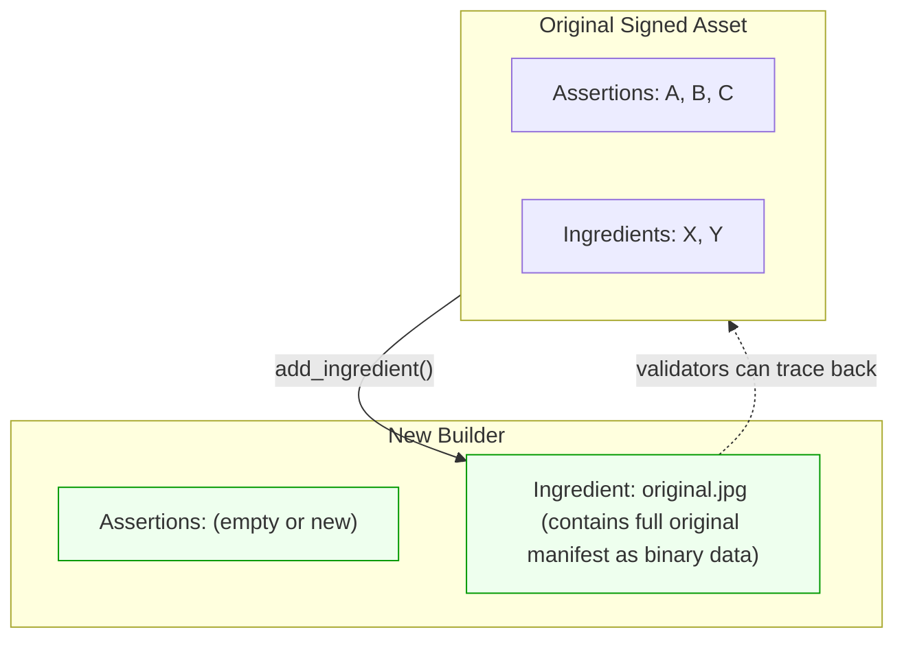
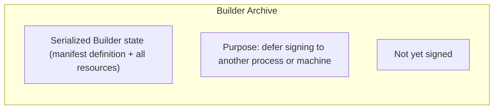
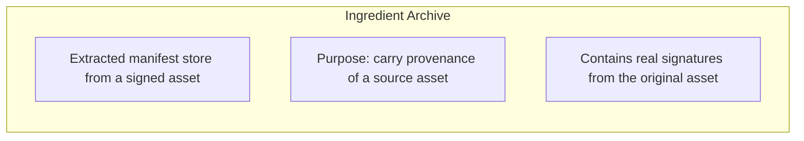
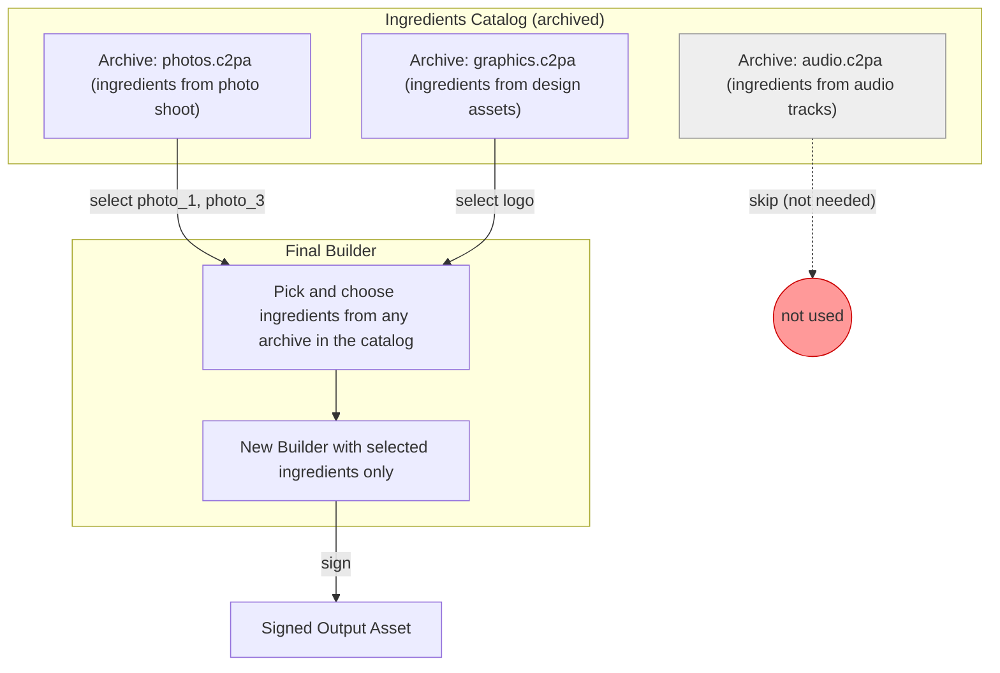
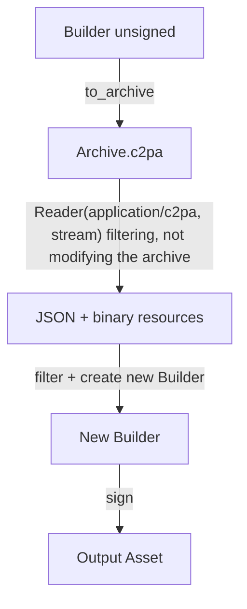
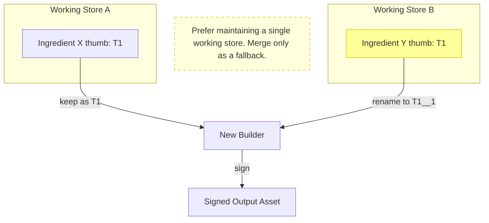
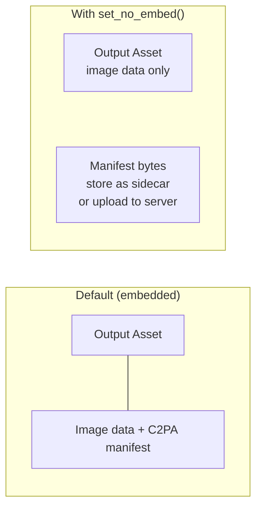
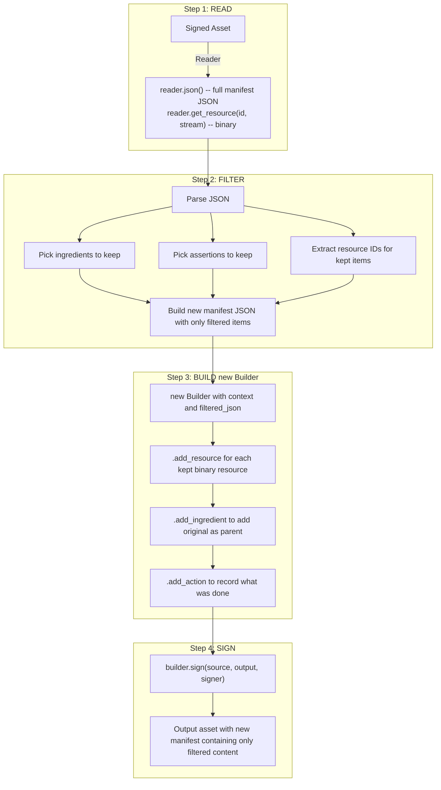
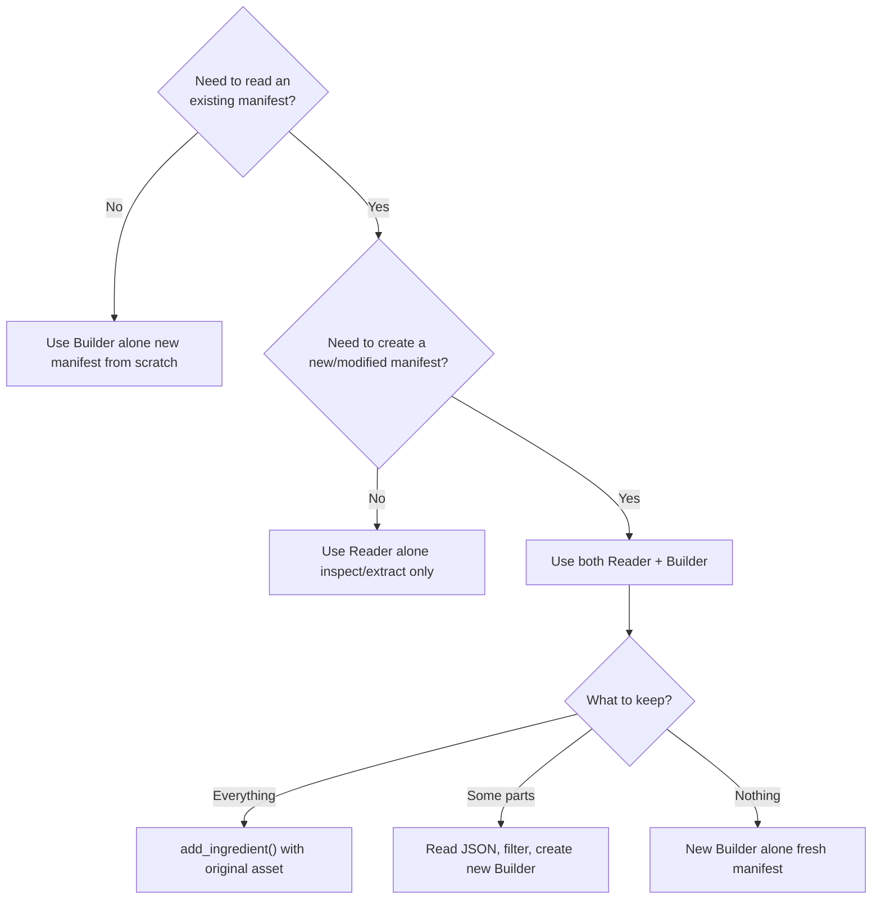

# Selective manifest construction with Builder and Reader

`Builder` and `Reader` can be used together to selectively construct manifests, keeping only the parts needed and leaving out the rest. This is usfeul in the case where not all ingredients on a working store should be added (e.g. in the case where ingredient assets are not visible). This process is best described as filtering, or rebuilding a working store:

1. Read an existing manifest.
1. Choose which elements to retain.
1. Build a new manifest containing only those elements.

A C2PA manifest is a signed data structure attached to an asset (such as an image or video) that records provenance information: who created it, what tools were used, what edits were made, and what source assets (ingredients) contributed to it. A manifest contains assertions (statements about the asset), ingredients (references to other assets used to create the signed asset), and binary resources (like thumbnails).

Since both `Reader` and `Builder` are **read-only by design** (there is no `remove()` method on either), the way to "remove" content is to **read what exists, filter out what is needed, and create a new `Builder` with only that information added back on the new Builder**. This process produces a new `Builder` instance ("rebuild").

> **Important**: This process always creates a new `Builder`. The original signed asset and its manifest are never modified, neither is the starting working store. The `Reader` extracts data without side effects, and the `Builder` constructs a new manifest based on extracted data.

## Core concept


The fundamental workflow is:

1. **Read** the existing manifest with `Reader` to get JSON and binary resources
2. **Identify and filter** the parts to keep (parse the JSON, select and gather elements)
3. **Create a new `Builder`** with only the selected parts based on the applied filtering rules
4. **Sign** the new `Builder` into the output asset

## Reading an existing manifest

Use `Reader` to extract the manifest store JSON and any binary resources (thumbnails, manifest data).
The `Reader` does not modify the source asset in any way.

```cpp
c2pa::Context context;
c2pa::Reader reader(context, "image/jpeg", source_stream);

// Get the full manifest store as JSON
std::string store_json = reader.json();
auto parsed = json::parse(store_json);

// Identify the active manifest, which is the current/latest manifest
std::string active = parsed["active_manifest"];
auto manifest = parsed["manifests"][active];

// Access specific parts
auto ingredients  = manifest["ingredients"];
auto assertions   = manifest["assertions"];
auto thumbnail_id = manifest["thumbnail"]["identifier"];
```

### Extracting binary resources

The JSON returned by `reader.json()` only contains string identifiers (JUMBF URIs) for binary data like thumbnails and ingredient manifest stores. The actual binary content must be extracted separately using `get_resource()`:

```cpp
// Extract a thumbnail to a stream
std::stringstream thumb_stream(std::ios::in | std::ios::out | std::ios::binary);
reader.get_resource(thumbnail_id, thumb_stream);

// Or extract to a file
reader.get_resource(thumbnail_id, fs::path("thumbnail.jpg"));
```

## Filtering into a new Builder

Each example below creates a **new `Builder`** from filtered data. The original asset (and its manifest store) remains as is.

When rebuilding by transferring ingredients between a `Reader` and a **new** `Builder`, remember that both the JSON metadata and the associated binary resources (thumbnails, manifest data) must be transferred. The JSON contains identifiers that reference binary resources. Those identifiers must match what you register with `builder.add_resource()`.

### Example 1: Keep only specific ingredients

```cpp
c2pa::Context context;
c2pa::Reader reader(context, "image/jpeg", source_stream);
auto parsed = json::parse(reader.json());
std::string active = parsed["active_manifest"];
auto ingredients = parsed["manifests"][active]["ingredients"];

// Filter: keep only ingredients with a specific relationship
json kept_ingredients = json::array();
for (auto& ingredient : ingredients) {
    if (ingredient["relationship"] == "parentOf") {
        kept_ingredients.push_back(ingredient);
    }
}

// Create a new Builder with only the kept ingredients
json new_manifest = json::parse(base_manifest_json);
new_manifest["ingredients"] = kept_ingredients;

c2pa::Builder builder(context, new_manifest.dump());

// Transfer binary resources for kept ingredients only
for (auto& ingredient : kept_ingredients) {
    // Transfer thumbnail
    if (ingredient.contains("thumbnail")) {
        std::string thumb_id = ingredient["thumbnail"]["identifier"];
        std::stringstream thumb(std::ios::in | std::ios::out | std::ios::binary);
        reader.get_resource(thumb_id, thumb);
        thumb.seekg(0);
        builder.add_resource(thumb_id, thumb);
    }
    // Transfer manifest_data (the ingredient's own C2PA manifest)
    if (ingredient.contains("manifest_data")) {
        std::string md_id = ingredient["manifest_data"]["identifier"];
        std::stringstream md(std::ios::in | std::ios::out | std::ios::binary);
        reader.get_resource(md_id, md);
        md.seekg(0);
        builder.add_resource(md_id, md);
    }
}

// Sign the new Builder into an output asset
builder.sign(source_path, output_path, signer);
```

### Example 2: Keep only specific assertions

```cpp
auto assertions = parsed["manifests"][active]["assertions"];

json kept_assertions = json::array();
for (auto& assertion : assertions) {
    // Keep training-mining assertions, filter out everything else
    if (assertion["label"] == "c2pa.training-mining") {
        kept_assertions.push_back(assertion);
    }
}

json new_manifest = json::parse(R"({
    "claim_generator_info": [{"name": "c2pa-cpp-docs", "version": "0.1.0"}]
})");
new_manifest["assertions"] = kept_assertions;

// Create a new Builder with only the filtered assertions
c2pa::Builder builder(context, new_manifest.dump());
builder.sign(source_path, output_path, signer);
```

### Example 3: Start fresh and preserve provenance

Sometimes all existing assertions and ingredients may need to be discarded but the provenance chain should be maintained nevertheless. This is done by creating a new `Builder` with a new manifest definition and adding the original signed asset as an ingredient using `add_ingredient()`.

The function `add_ingredient()` does not copy the original's assertions into the new manifest. Instead, it stores the original's entire manifest store as opaque binary data inside the ingredient record. This means:

- The new manifest has its own, independent set of assertions
- The original's full manifest is preserved inside the ingredient, so validators can inspect the full provenance history
- The provenance chain is unbroken: anyone reading the new asset can follow the ingredient link back to the original



```cpp
// Create a new Builder with a new definition
c2pa::Builder builder(context);
builder.with_definition(R"({
    "claim_generator_info": [{"name": "c2pa-cpp-docs", "version": "0.1.0"}],
    "assertions": []
})");

// Add the original as an ingredient to preserve provenance chain.
// add_ingredient() stores the original's manifest as binary data inside the ingredient,
// but does NOT copy the original's assertions into this new manifest.
builder.add_ingredient(R"({"title": "original.jpg", "relationship": "parentOf"})",
                       original_signed_path);
builder.sign(source_path, output_path, signer);
```

## Working with archives

A `Builder` represents a **working store**: a manifest that is being assembled but has not yet been signed. Archives serialize this working store (definition + resources) to a `.c2pa` binary format, allowing to save, transfer, or resume the work later.

There are two distinct types of archives, sharing the same binary format but being conceptually different: builder archives (working stores archives) and ingredient archives.

### Builder archives vs. ingredient archives





|                                    | Builder archive                                                                              | Ingredient archive                                                                                     |
|------------------------------------|----------------------------------------------------------------------------------------------|--------------------------------------------------------------------------------------------------------|
| **What it contains**               | The full `Builder` state: manifest definition, resources, and ingredients (not yet signed)    | The manifest store data from ingredients that were added to a `Builder`                                 |
| **Purpose**                        | Persist a work-in-progress `Builder` so it can be resumed or signed later                    | Carry the provenance history of a source asset so it can be embedded as an ingredient in a new manifest |
| **Created by**                     | `builder.to_archive(stream)`                                                                 | Extracted from a signed asset's `manifest_data` via `Reader`                                           |
| **Read with**                      | `Builder::from_archive(stream)` or `builder.with_archive(stream)`                            | Passed to `builder.add_resource(id, stream)` alongside ingredient JSON                                 |

### The ingredients catalog pattern

A usage example of ingredient archives is building an **ingredients catalog**: a collection of archived ingredients (with 1 ingredient per archive) that can be picked and chosen from when constructing a final manifest. Each archive in the catalog holds ingredients, and at build time select only the ones you need.



```cpp
// Read from a catalog of archived ingredients
c2pa::Context archive_ctx(R"({"verify": {"verify_after_reading": false}})");

// Open one archive from the catalog
archive_stream.seekg(0);
c2pa::Reader reader(archive_ctx, "application/c2pa", archive_stream);
auto parsed = json::parse(reader.json());
std::string active = parsed["active_manifest"];
auto available_ingredients = parsed["manifests"][active]["ingredients"];

// Pick only the ingredients you need
json selected = json::array();
for (auto& ingredient : available_ingredients) {
    if (ingredient["title"] == "photo_1.jpg" || ingredient["title"] == "logo.png") {
        selected.push_back(ingredient);
    }
}

// Create a new Builder with selected ingredients
json manifest = json::parse(R"({
    "claim_generator_info": [{"name": "c2pa-cpp-docs", "version": "0.1.0"}]
})");
manifest["ingredients"] = selected;
c2pa::Builder builder(context, manifest.dump());

// Transfer binary resources for selected ingredients
for (auto& ingredient : selected) {
    if (ingredient.contains("thumbnail")) {
        std::string id = ingredient["thumbnail"]["identifier"];
        std::stringstream stream(std::ios::in | std::ios::out | std::ios::binary);
        reader.get_resource(id, stream);
        stream.seekg(0);
        builder.add_resource(id, stream);
    }
    if (ingredient.contains("manifest_data")) {
        std::string id = ingredient["manifest_data"]["identifier"];
        std::stringstream stream(std::ios::in | std::ios::out | std::ios::binary);
        reader.get_resource(id, stream);
        stream.seekg(0);
        builder.add_resource(id, stream);
    }
}

builder.sign(source_path, output_path, signer);
```

### Extracting ingredients from a builder archive

A Builder archive (or working store archive) can be read with `Reader` to filter its contents without modifying the original archive and use the selected filtered content to create a **new** Builder. This produces a new `Builder`:



```cpp
// Read the archive. This does not modify the archive
archive_stream.seekg(0);
c2pa::Reader reader(archive_ctx, "application/c2pa", archive_stream);
auto parsed = json::parse(reader.json());
std::string active = parsed["active_manifest"];
auto ingredients = parsed["manifests"][active]["ingredients"];

// Create a new Builder with extracted ingredients
json new_manifest = json::parse(base_manifest_json);
new_manifest["ingredients"] = ingredients;

c2pa::Builder builder(context, new_manifest.dump());

// Transfer binary resources
for (auto& ingredient : ingredients) {
    if (ingredient.contains("thumbnail")) {
        std::string id = ingredient["thumbnail"]["identifier"];
        std::stringstream stream(std::ios::in | std::ios::out | std::ios::binary);
        reader.get_resource(id, stream);
        stream.seekg(0);
        builder.add_resource(id, stream);
    }
    if (ingredient.contains("manifest_data")) {
        std::string id = ingredient["manifest_data"]["identifier"];
        std::stringstream stream(std::ios::in | std::ios::out | std::ios::binary);
        reader.get_resource(id, stream);
        stream.seekg(0);
        builder.add_resource(id, stream);
    }
}

builder.sign(source_path, output_path, signer);
```

### Merging multiple working stores

In some cases you may need to merge ingredients from multiple working stores (builder archives) or multiple working stores into a single `Builder`. This should be a **fallback strategy** as the recommended practice is to maintain a **single** active working store and reuse it by adding ingredients incrementally (which is where having archived ingredients catalogs can be helpful). Merging is available as a backup when you end up with multiple working stores that need to be consolidated.

When merging from multiple sources, resource identifier URIs can collide. One way to avoid collisions is to rename identifiers with a unique suffix:



```cpp
// Track used resource IDs to detect collisions
std::set<std::string> used_ids;
int suffix_counter = 0;

json all_ingredients = json::array();

for (auto& archive_stream : archives) {
    c2pa::Reader reader(archive_ctx, "application/c2pa", archive_stream);
    auto parsed = json::parse(reader.json());
    std::string active = parsed["active_manifest"];
    auto ingredients = parsed["manifests"][active]["ingredients"];

    for (auto& ingredient : ingredients) {
        // Check for thumbnail ID collision
        if (ingredient.contains("thumbnail")) {
            std::string id = ingredient["thumbnail"]["identifier"];
            if (used_ids.count(id)) {
                std::string new_id = id + "__" + std::to_string(++suffix_counter);
                ingredient["thumbnail"]["identifier"] = new_id;
                id = new_id;
            }
            used_ids.insert(id);
            // Transfer resource with the (possibly renamed) ID
            std::stringstream stream(std::ios::in | std::ios::out | std::ios::binary);
            reader.get_resource(id, stream);
            stream.seekg(0);
            builder.add_resource(id, stream);
        }
        all_ingredients.push_back(ingredient);
    }
}

// Create a single new Builder with all merged ingredients
json manifest = json::parse(R"({
    "claim_generator_info": [{"name": "c2pa-cpp-docs", "version": "0.1.0"}]
})");
manifest["ingredients"] = all_ingredients;
c2pa::Builder builder(context, manifest.dump());
builder.sign(source_path, output_path, signer);
```

## Controlling manifest embedding

By default, `sign()` embeds the manifest directly inside the output asset file.

### Remove the manifest from the asset entirely

Use `set_no_embed()` so the signed asset contains no embedded manifest. The manifest bytes are returned from `sign()` and can be stored separately (as a sidecar file, on a server, etc.):



```cpp
c2pa::Builder builder(context, manifest_json);
builder.set_no_embed();
builder.set_remote_url("<<URI/URL to remote storage of manifest bytes>>");

auto manifest_bytes = builder.sign("image/jpeg", source, dest, signer);
// manifest_bytes contains the full manifest store
// Upload manifest_bytes to the remote URL
// The output asset has no embedded manifest
```

Reading back:

```cpp
c2pa::Reader reader(context, "image/jpeg", dest);
reader.is_embedded();    // false
reader.remote_url();     // "<<URI/URL to remote storage of manifest bytes>>"
```

## Complete workflow diagram



## Q&A: Builder, Reader, or both?

This section answers questions about when to use each API and how they work together.

### When should I use a `Reader`?

**Use a `Reader` when you only need to inspect or extract data without creating a new manifest.**

- Validating whether an asset has C2PA credentials
- Displaying provenance information to a user
- Extracting thumbnails for display
- Checking trust status and validation results
- Inspecting ingredient chains

```cpp
c2pa::Reader reader(context, "image.jpg");
auto json = reader.json();               // inspect the manifest
reader.get_resource(thumb_id, stream);   // extract a thumbnail
```

The `Reader` is read-only. It never modifies the source asset.

### When should I use a `Builder`?

**Use a `Builder` when you are creating a manifest from scratch on an asset that has no existing C2PA data, or when you intentionally want to start with a clean slate.**

- Signing a brand-new asset for the first time
- Adding C2PA credentials to an unsigned asset
- Creating a manifest where you define all content yourself

```cpp
c2pa::Builder builder(context, manifest_json);
builder.add_ingredient(ingredient_json, source_path);  // add source material
builder.sign(source_path, output_path, signer);
```

Every call to the `Builder` constructor or `Builder::from_archive()` creates a new `Builder`. There is no way to modify an existing signed manifest directly.

### When should I use both `Reader` and `Builder` together?

**Use both when you need to filter content from an existing manifest into a new one. The `Reader` extracts data, your code filters it, and a new `Builder` receives only the selected parts.**

- Filtering specific ingredients from a manifest
- Dropping specific assertions while keeping others
- Merging ingredients from multiple signed assets or archives
- Extracting content from an ingredients catalog
- Re-signing with different settings while keeping some original content

```cpp
// Read existing (does not modify the asset)
c2pa::Reader reader(context, "signed.jpg");
auto parsed = json::parse(reader.json());

// Filter what to keep
auto kept = filter(parsed);  // your filtering logic

// Create a new Builder with only the filtered content
c2pa::Builder builder(context, kept.dump());
// ... transfer resources ...
builder.sign(source, output, signer);
```

### What is the difference between `add_ingredient()` and injecting ingredient JSON via `with_definition()`?

| Approach | What it does | When to use |
|----------|-------------|-------------|
| `add_ingredient(json, path)` | Reads the source asset, extracts its manifest store automatically, generates a thumbnail | Adding a signed asset as an ingredient; the library handles everything |
| Inject via `with_definition()` + `add_resource()` | When providing the ingredient JSON and all binary resources manually | Reconstructing from an archive or merging from multiple readers, where you already have the data extracted |

### When should I use archives?

There are two distinct archive concepts:

**Builder archives (Working stores archives)** (`to_archive` / `from_archive` / `with_archive`) serialize the full `Builder` state (manifest definition, resources, ingredients) so it can be resumed or signed later, possibly on a different machine or in a different process. The archive is not yet signed. Use builder archives when:

- Signing must happen on a different machine (e.g., an HSM server)
- You want to checkpoint work-in-progress before signing
- You need to transmit a `Builder` state across a network boundary

**Ingredient archives** contain the manifest store data (`.c2pa` binary) from ingredients that were added to a `Builder`. When a signed asset is added as an ingredient via `add_ingredient()`, the library extracts and stores its manifest store as `manifest_data` within the ingredient record. When the `Builder` is then serialized via `to_archive()`, these ingredient manifest stores are included. Use ingredient archives when:

- Building an ingredients catalog for pick-and-choose workflows
- Preserving provenance history from source assets
- Transferring ingredient data between `Reader` and `Builder`

Key consideration for builder archives: `from_archive()` creates a new `Builder` with **default** context settings. If you need specific settings (e.g., thumbnails disabled), use `with_archive()` on a `Builder` that already has the desired context:

```cpp
// Preserves your context settings
c2pa::Builder builder(my_context);
builder.with_archive(archive_stream);
builder.sign(source, output, signer);
```

### Can I modify a manifest in place?

**No.** C2PA manifests are cryptographically signed. Any modification invalidates the signature. The only way to "modify" a manifest is to create a new `Builder` with the changes you want and sign it. This is by design: it ensures the integrity of the provenance chain.

### What happens to the provenance chain when I rebuild?

When you create a new manifest, the chain is preserved once you add the original asset as an ingredient. The ingredient carries the original's manifest data, so validators can trace the full history:


If you don't add the original as an ingredient, the provenance chain is broken: the new manifest has no link to the original. This might be intentional (starting fresh) or a mistake (losing provenance).

### Quick reference decision tree


